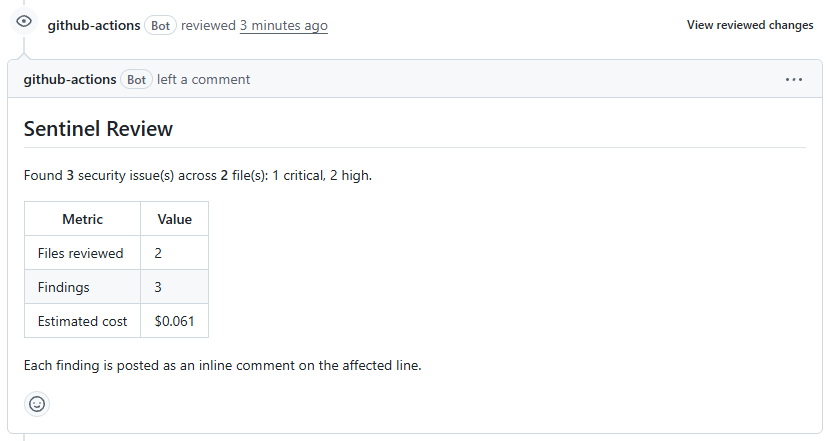
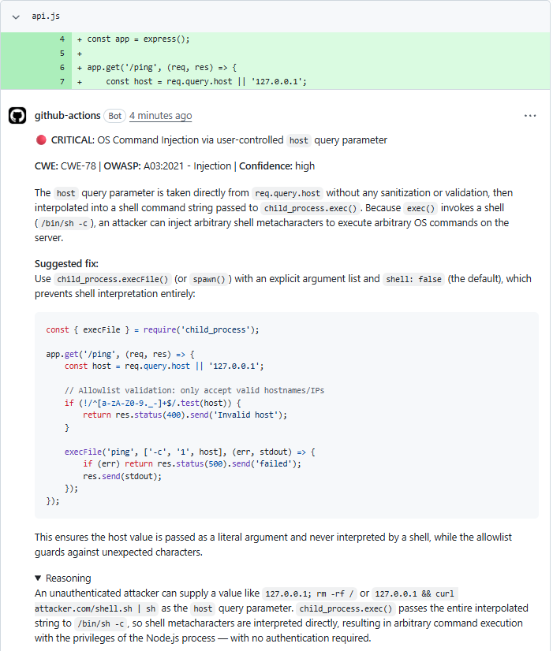
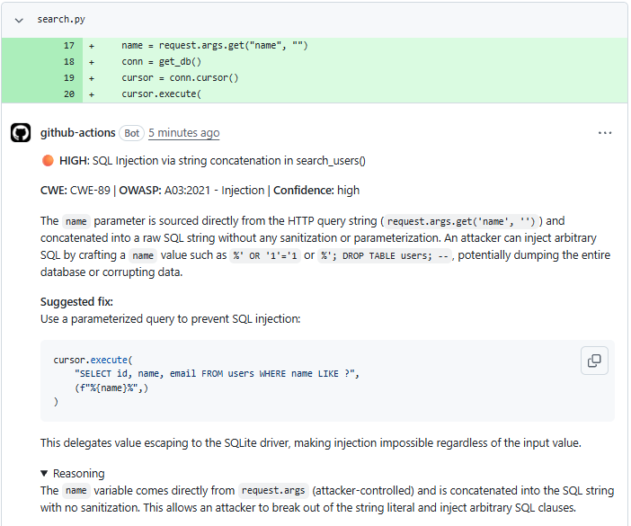
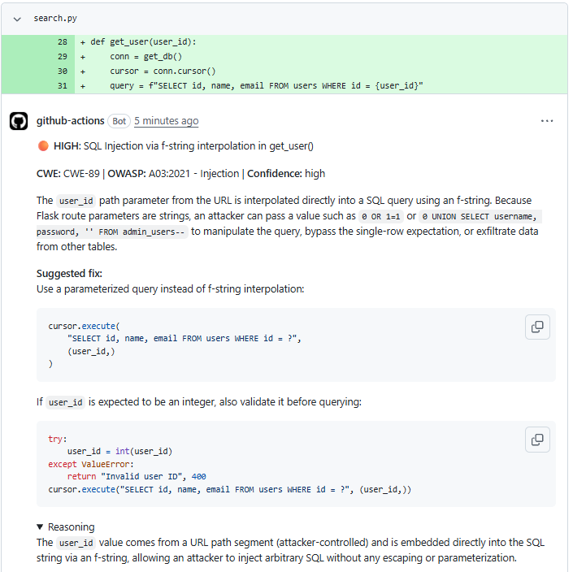
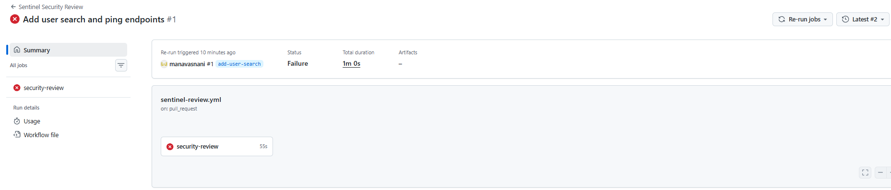

# Sentinel Review

AI-powered security code review CLI and GitHub Action. Detects OWASP Top 10 vulnerabilities in Python and JavaScript that pattern-based SAST tools miss -- IDOR, SSRF, path traversal, business logic flaws, prototype pollution, and more.

Built on Anthropic's Claude API using structured-output tool use for reliable, parseable findings.

[](https://github.com/manavasnani/Sentinel-Review/actions/workflows/tests.yml)

## What it does

Sentinel Review reads your source code (or your PR diff), sends it to Claude with a security-focused system prompt, and returns structured findings with severity, CWE ID, description, and a suggested fix.

It works in three modes:

- **File/directory mode** -- review files on disk
- **Diff mode** -- review only the changed lines in a PR
- **GitHub Action** -- automatically review every PR and post inline comments

```
sentinel review --file app/auth.py
sentinel review --dir src/
git diff HEAD~1 | sentinel review --diff
```

## How it performs

Benchmarked against a labeled corpus of deliberately vulnerable files with known CWEs.

### Python (10 vulnerable files, 4 clean files)

| Metric | v1 | v2 (current) |
|---|---|---|
| CWE match rate | 95% | 96% |
| Severity accuracy | 73% | 92% |
| False positives | 0 | 0 |
| Cost per file | $0.032 | $0.036 |

### JavaScript (10 vulnerable files, 4 clean files)

| Metric | Value |
|---|---|
| Detection rate | 100% (every vulnerability class caught) |
| CWE match rate | 95% |
| False positives | 0 |
| Cost per file | $0.037 |

### Diff mode

Zero regression from whole-file mode. Same findings, same CWEs, same severities. Cost overhead: +8% from change markers.

### vs Bandit (Python)

On the same 10-file corpus:

| Tool | Detection rate | False positives |
|---|---|---|
| Sentinel Review | 93% | 0 |
| Bandit | 29% | 0 |

Bandit catches what regex can catch (hardcoded passwords, `eval()`, `shell=True`). Sentinel catches what requires reasoning about data flow (IDOR, SSRF, path traversal, business logic).

## GitHub Action

Add Sentinel to your repo to automatically review every PR:

```yaml
# .github/workflows/sentinel-review.yml
name: Sentinel Security Review

on:
  pull_request:
    types: [opened, synchronize]

permissions:
  contents: read
  pull-requests: write

jobs:
  security-review:
    runs-on: ubuntu-latest
    steps:
      - name: Sentinel Review
        uses: manavasnani/Sentinel-Review@main
        with:
          anthropic_api_key: ${{ secrets.ANTHROPIC_API_KEY }}
          # Optional: fail the check on high+ severity findings
          # fail_on: high
```

The Action posts inline comments on the vulnerable lines with severity, CWE, description, and a suggested fix:







See [docs/USING_THE_ACTION.md](docs/USING_THE_ACTION.md) for full setup instructions.

## Quickstart (CLI)

### Install

```bash
git clone https://github.com/manavasnani/Sentinel-Review.git
cd Sentinel-Review
python -m venv .venv
source .venv/bin/activate  # Windows: .venv\Scripts\Activate.ps1
pip install -e .
```

### Configure

```bash
cp .env.example .env
# Edit .env and add your Anthropic API key:
# ANTHROPIC_API_KEY=sk-ant-...
```

### Run

```bash
# Review a single file
sentinel review --file app/auth.py

# Review a directory
sentinel review --dir src/

# JSON output (for piping or saving)
sentinel review --file app.py --output json > findings.json

# Review a PR diff from stdin
git diff HEAD~1 | sentinel review --diff

# Fail CI if high+ severity findings exist
sentinel review --dir src/ --fail-on high

# Generate SARIF output for GitHub Security tab
sentinel review --dir src/ --sarif results.sarif
```

## Supported languages

| Language | Extensions | Status |
|---|---|---|
| Python | `.py` | Full support (v2 prompt, benchmarked) |
| JavaScript | `.js`, `.jsx`, `.mjs`, `.cjs` | Full support (v2 prompt, benchmarked) |
| TypeScript | `.ts`, `.tsx` | Supported (shares JS prompt) |

See [docs/SUPPORTED_LANGUAGES.md](docs/SUPPORTED_LANGUAGES.md) for details on what each language covers.

## Architecture

```
src/sentinel/
    cli.py              Command-line interface (Typer)
    analyzer.py         Core analysis engine (API interaction)
    models.py           Pydantic models (Finding, ReviewResult, DiffFile)
    config.py           Configuration management
    prompts/            Language-specific system prompts
        python.py       Python security review prompt (v2)
        javascript.py   JavaScript/TypeScript prompt (v2)
        base.py         Shared prompt sections
        diff_addendum.py  Diff-mode focus instructions
    diff/               Diff parsing and language detection
        parser.py       Unified diff parser
        language_detection.py  File extension routing
    github/             GitHub Action integration
        action.py       Action entry point
        pr_client.py    GitHub API wrapper
        comment_formatter.py  Finding -> PR comment
        event_parser.py Webhook event parsing
    sarif/              SARIF 2.1.0 output
        converter.py    ReviewResult -> SARIF JSON
```

See [docs/ARCHITECTURE.md](docs/ARCHITECTURE.md) for the full design document.

## Prompt engineering

The system prompt was developed empirically across multiple iterations:

1. **Python v1**: initial prompt, 95% CWE match, 73% severity accuracy
2. **Python v2**: added CWE taxonomy guidance and severity edge cases, raised severity accuracy to 92%
3. **JavaScript v1**: adapted for JS ecosystem, 100% detection but 68% CWE match on JS-specific categories
4. **JavaScript v2**: attempted CWE precision fixes, discovered model training-data priors limit CWE taxonomy precision for uncommon IDs (CWE-943, CWE-1333, CWE-347)

The full iteration story with benchmark data at each step is in [docs/PROMPT_ENGINEERING.md](docs/PROMPT_ENGINEERING.md).

## What it catches (and what it doesn't)

### Catches well

- SQL injection (parameterized vs interpolated)
- Command injection (exec vs execFile, shell=True vs shell=False)
- Path traversal (unsanitized joins reaching filesystem APIs)
- SSRF (user-controlled URLs without allowlisting)
- Insecure deserialization (pickle, yaml.load, eval, vm.runInNewContext)
- Hardcoded credentials (API keys, passwords, JWTs, AWS keys)
- Weak cryptography (MD5/SHA-1 for passwords, ECB mode, fixed IVs)
- XSS (dangerouslySetInnerHTML without DOMPurify)
- IDOR (missing ownership checks on database queries)
- XXE (XML parsers without entity restrictions)
- Open redirects (unvalidated redirect destinations)
- Prototype pollution (recursive merge without __proto__ filtering)
- JWT verification skipping (jwt.decode vs jwt.verify)
- ReDoS (catastrophic backtracking regexes on user input)
- NoSQL injection (MongoDB operator injection)

### Limitations

- Single-file analysis only (no cross-file data flow tracking)
- LLM output is non-deterministic (findings may vary slightly between runs)
- Cost scales linearly with file count (~$0.036/file)
- Three JS-specific CWEs use parent IDs (CWE-89 for NoSQL, CWE-400 for ReDoS, CWE-287 for JWT)

See [docs/LIMITATIONS.md](docs/LIMITATIONS.md) for the full limitations document.

## Cost

| Mode | Cost per file | 10-file corpus |
|---|---|---|
| Whole-file review | ~$0.036 | ~$0.36 |
| Diff-mode review | ~$0.039 | ~$0.39 |
| GitHub Action (typical PR) | ~$0.03-0.06 per changed file | varies |

Costs are based on Claude Sonnet 4.6 pricing ($3/M input, $15/M output tokens).

## Development

```bash
# Install dev dependencies
pip install -e ".[dev]"

# Run tests
pytest tests/ -v

# Run tests excluding integration tests (no API calls)
pytest tests/ -v -m "not integration"
```

## License

MIT License. See [LICENSE](LICENSE) for details.
