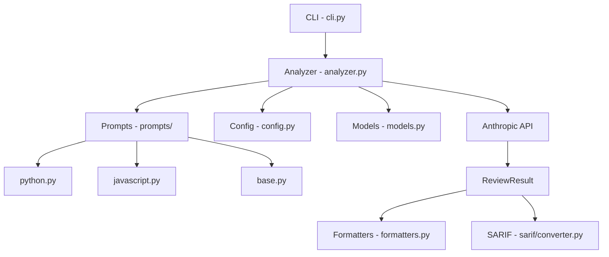
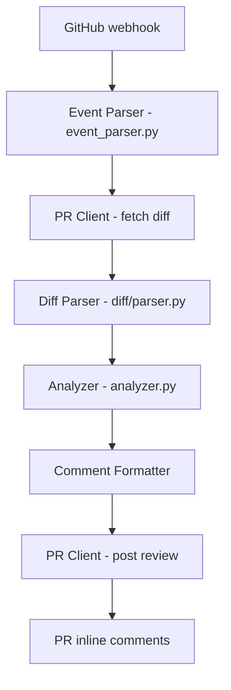
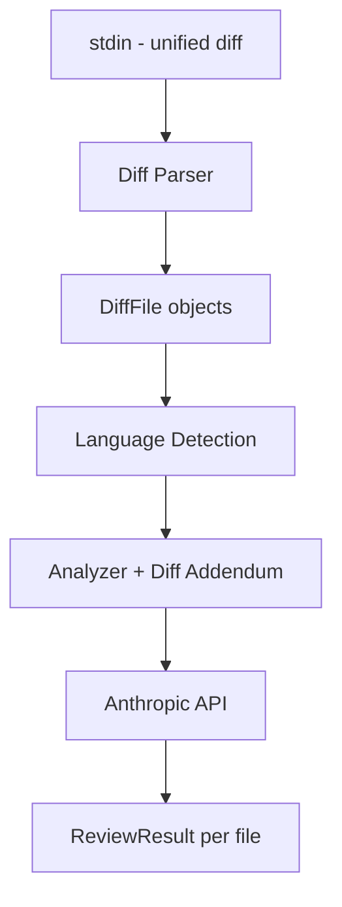

# Architecture

How Sentinel Review is structured and why.

## Overview

Sentinel Review is a Python package that sends source code to Claude
with a security-focused system prompt and parses the structured response
into findings. It runs as a CLI tool, a GitHub Action, or both.

## CLI flow

When you run `sentinel review --file app.py` or `sentinel review --dir src/`:

1. CLI parses arguments and determines the mode (file, directory, or diff)
2. For each file, the analyzer detects the language and selects the matching prompt
3. Code is sent to Claude with the system prompt and few-shot examples
4. Claude responds via the `report_security_findings` tool with structured findings
5. Findings are parsed into Pydantic models and rendered as pretty output, JSON, or SARIF

## GitHub Action flow

When a PR is opened or updated:

1. GitHub triggers the Action on `pull_request` events
2. Event parser reads the webhook payload to get PR number and commit SHAs
3. PR client fetches the unified diff from the GitHub API
4. Diff parser extracts changed files, filters unsupported languages
5. Each file is analyzed with the language-specific prompt in diff mode
6. Findings are formatted as markdown and posted as inline PR review comments

## Diff mode flow

When you run `git diff HEAD~1 | sentinel review --diff`:

The diff parser produces `DiffFile` objects with `[CHANGED]`/`[CONTEXT]`
line markers. The diff-mode addendum is appended to the system prompt,
instructing the model to focus on changed lines.

## Package structure

### src/sentinel/

**cli.py** -- Typer-based command-line interface. Supports three modes:
`--file` (single file), `--dir` (directory scan), `--diff` (stdin diff).
Handles output formatting, exit codes, and SARIF generation. Intentionally
thin: it parses arguments and delegates to the analyzer.

**analyzer.py** -- Core analysis engine. Two public functions:
`analyze_code()` for whole-file review and `analyze_diff_file()` for
diff-mode review. Both delegate to `_call_api_and_parse()`, a shared
helper that handles the Anthropic API call, retry logic, response parsing,
and ReviewResult construction. This shared helper is the key architectural
decision: it means adding a new analysis mode only requires writing a new
caller function, not duplicating API interaction code.

**models.py** -- Pydantic models for structured data. `Finding` represents
one vulnerability. `ReviewResult` wraps a list of findings with metadata
(tokens, timing, model). `DiffFile` represents one changed file from a
diff. `Language` enum routes to the correct prompt module. `Severity` and
`Confidence` are validated enums that prevent typos.

**config.py** -- Configuration from environment variables and `.env` files.
API key, model name, retry parameters, max tokens. Frozen dataclass so
config is immutable after construction.

**exceptions.py** -- Exception hierarchy. `SentinelError` is the base.
`ConfigurationError`, `AnalysisError`, `APIError`, `ParseError` are
children. The CLI maps each to an appropriate exit code.

**formatters.py** -- Output rendering. `render_pretty()` for terminal
display with Rich. `to_json()` for machine-readable output.

### src/sentinel/prompts/

Language-aware prompt package. Each language gets its own module with a
system prompt, few-shot examples, and a request formatter.

**base.py** -- Shared sections used across all languages: prompt injection
defense and structured output instructions. Extracted here so adding a
new language doesn't require duplicating these sections.

**python.py** -- Python-specific system prompt (v2). Covers 14 vulnerability
classes, anti-patterns for parameterized queries / bcrypt / subprocess,
severity edge cases for crypto and command injection. Four few-shot examples.

**javascript.py** -- JavaScript/TypeScript system prompt (v2). Covers
everything Python does plus prototype pollution, ReDoS, NoSQL injection,
JWT verification, and dangerouslySetInnerHTML XSS. Six few-shot examples.
TypeScript shares this module since type annotations don't affect security
analysis.

**diff_addendum.py** -- Appended to any language's system prompt when
running in diff mode. Instructs the model to focus on `[CHANGED]` lines
and ignore pre-existing issues in `[CONTEXT]` lines, with an exception
for critical findings within 5 lines of changes.

**__init__.py** -- Routing layer. `get_prompt_module(language)` returns
the correct module for a given Language enum value. Also re-exports
Python prompt names for backward compatibility with Phase 1 code paths.

### src/sentinel/diff/

Diff parsing and language detection.

**parser.py** -- Parses unified diff text (from `git diff` or the GitHub
API) into `DiffFile` objects using the `unidiff` library. Filters out
deleted files, binary files, and unsupported languages at parse time.
Reconstructs the new file content with gap markers between non-contiguous
hunks.

**language_detection.py** -- Maps file extensions to `Language` enum
values. Built as a reverse index from the enum's `file_extensions`
property so adding a new language to the enum automatically updates
detection. Three functions: `detect_language()`, `is_supported()`,
`supported_extensions()`.

### src/sentinel/github/

GitHub Action integration.

**action.py** -- Main entry point for the Action container. Orchestrates
the full flow: parse event, fetch diff, parse diff, analyze each file,
format comments, post review. Handles dry-run mode, SARIF output, and
exit codes based on severity threshold.

**event_parser.py** -- Reads the GitHub Actions event payload from
`GITHUB_EVENT_PATH` and extracts PR context: owner, repo, PR number,
head SHA, base SHA. Returns a frozen `PRContext` dataclass.

**pr_client.py** -- GitHub REST API wrapper. `fetch_pr_diff()` gets the
unified diff (using raw requests with the diff Accept header).
`post_review()` creates a PR review with inline comments (using PyGithub).

**comment_formatter.py** -- Converts findings to PR comment markdown.
Each finding gets a formatted comment with severity emoji, CWE, OWASP
category, description, suggested fix, and collapsible reasoning section.
The review summary aggregates finding counts and cost.

### src/sentinel/sarif/

SARIF 2.1.0 output for GitHub's Security tab.

**converter.py** -- Transforms `ReviewResult` objects into a SARIF JSON
document. Maps Sentinel severity to SARIF levels and security-severity
scores. Generates stable fingerprints for cross-run deduplication.

## Design decisions

### Structured output via tool use

Sentinel uses Anthropic's tool use API with `tool_choice: {"type": "tool",
"name": "report_security_findings"}` to force the model to respond with
a structured JSON schema. This is more reliable than asking the model
to produce JSON in free text, because the API enforces the schema server-side.

The tool schema defines all finding fields as required, which means every
finding the model produces has severity, CWE, description, suggested fix,
line numbers, and reasoning. Downstream code never has to handle missing
fields.

### Prompts as Python code, not config files

Prompts live in `.py` files, not `.yaml` or `.json` config. This is
intentional. Python files support:

- Type hints and constants (`Final[str]`)
- Inline comments explaining design decisions
- Functions (`format_review_request`) alongside the prompt text
- IDE support (syntax highlighting, search, refactoring)

The tradeoff is that changing a prompt requires a code change, not a config
change. For a security tool where prompt quality directly affects output
quality, this is the right tradeoff: prompt changes should go through
code review.

### Language routing via enum

The `Language` enum is the single source of truth for supported languages.
Adding a new language requires:

1. Adding an enum value with file extensions
2. Creating a prompt module
3. Registering it in `__init__.py`

Language detection, file collection, and prompt routing all derive from
the enum. This prevents the "I added the prompt but forgot to update the
file filter" class of bugs.

### Shared _call_api_and_parse helper

The analyzer has one shared function for API interaction. Both
`analyze_code()` and `analyze_diff_file()` choose their own system prompt
and user message, then delegate to this shared helper. This means:

- Retry logic, token counting, and result construction are in one place
- Adding a new analysis mode doesn't duplicate API code
- Testing the API interaction requires mocking one function

### Diff-mode addendum is appended, not merged

The diff-mode prompt is a separate string appended to the language-specific
prompt at request time. This keeps language prompts unchanged between
whole-file and diff mode. The addendum modifies the reviewer's focus
(what to flag) without changing its knowledge (what vulnerabilities exist).

### Defensive Pydantic models

All models use `frozen=True` (immutable after construction) and
`extra="forbid"` (rejects unknown fields). Line ranges are validated
(end >= start, both >= 1). This catches bugs at construction time
rather than letting bad data propagate through the system and cause
confusing downstream failures.
